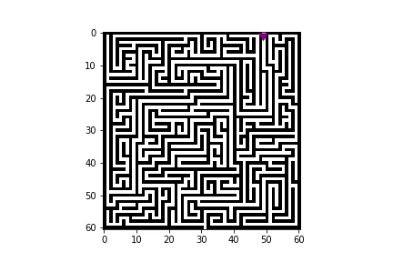

# hobby_project

# An eclectic assortment of non-work example projects.

## 1. [Maze Solving] Solved mazes from Maze Solving.ipynb:

## 2. [Guess Watch Prices] Is it possible to guess prices of luxury watches? Also, use Selenium to get around some website practices of hiding merchandise prices.
### Use Selenium to retrieve info on all 1510 watches from www.Longines.com. Analyze & process the data. Then use linear regression to appraise any hypothetical Longines watches. Which physical factors significantly dictate watch prices?

